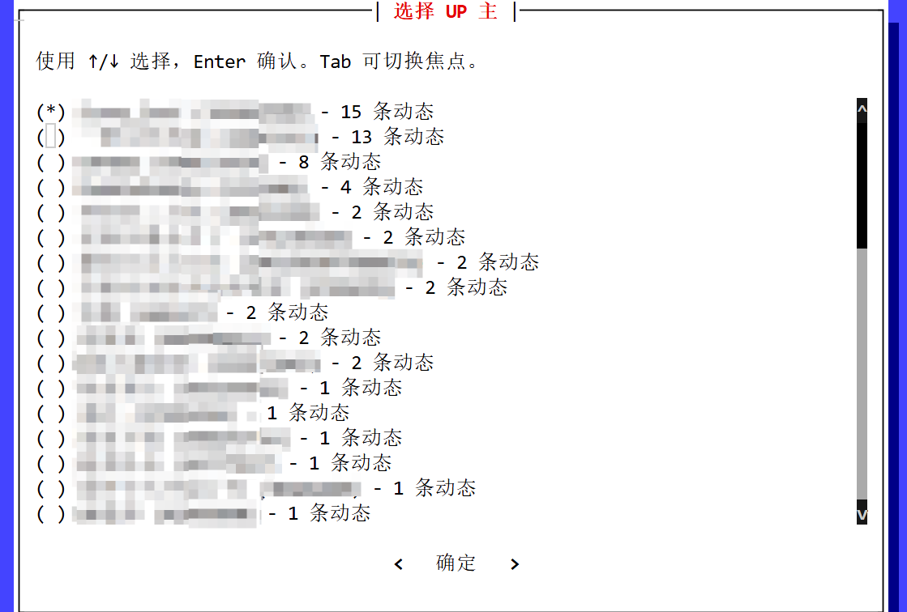
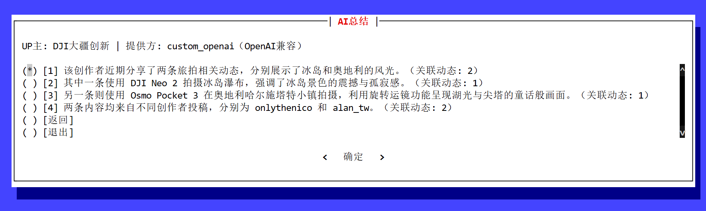

# BiliDynamicSummary

[简体中文 README](README.zh-CN.md)

A prompt_toolkit-based TUI tool that fetches, filters, sorts, and summarizes personalized Bilibili dynamics (videos, posts, articles, etc.) in a selected time range via web cookie-authenticated APIs.




## Features
- Time range filter (custom / last 24 hours / 7 days / 30 days / 365 days / this year / unlimited)
- Keyword filter (space-separated terms, AND logic)
- Sort followed UPs by dynamic count (ascending/descending)
- Summary/detail list mode
- Paginated dynamic browsing
- Local cache with TTL
- AI summary per UP (each summary sentence can map back to related dynamics)
- Bilingual UI (auto-detect or manual setting)

## Requirements
- Python 3.8+
- `requests`
- `prompt_toolkit`

Install dependencies:
```powershell
python -m pip install requests prompt_toolkit
```

## Quick Start
```powershell
python BiliDynamicSummary.py --sessdata "YOUR_SESSDATA"
```

You can also pass a full cookie string:
```powershell
python BiliDynamicSummary.py --cookie "YOUR_FULL_COOKIE"
```

## How To Get Web Cache Data
Using Google Chrome on Windows environment as an example:

### Get `SESSDATA`
1. Open https://t.bilibili.com/
2. Press `F12` to open DevTools, then open `Application` (under `More tabs`)
3. Find `Cookies` -> `https://t.bilibili.com`
4. Copy the `SESSDATA` value

### Get Full Cookie
1. Open https://t.bilibili.com/
2. Press `F12` and switch to `Network`
3. Enable `Preserve log`, then choose `XHR/Fetch`
4. Refresh the page
5. Search `web-dynamic`
6. Open the matched request and check `Headers`
7. Find a Request URL like `https://api.bilibili.com/x/polymer/web-dynamic/v1/feed/all?...`
8. Scroll to `Request Headers`, then copy the `Cookie` value

---

## Usage Flow
0. Run in terminal:
```powershell
python BiliDynamicSummary.py --sessdata "YOUR_SESSDATA"
```
1. Enter **Current Settings**
2. Choose **Edit Settings** (optional)
3. Choose **Start Fetch**
4. In **Select UP**, pick the UP you want to inspect
5. Browse that UP's dynamic list with pagination and detail view
6. In that UP list, choose **AI Summary** to view summary + linked dynamics

## Keyboard
- Arrow keys: move selection
- Enter: confirm
- Tab: switch current focus

## Parameters
- `type`: dynamic type (`all` / `video` / `pgc` / `article`)
- `pages`: max API pages to fetch (larger time ranges usually need larger values)
- `page_size`: items per page in list view
- `sort`: UP sorting (`desc` / `asc`)
- `view`: list mode (`summary` / `detail`)
- `keyword`: keyword filter (space-separated terms; all must match)
- `time_from`, `time_to`: time range
- `cache`: enable cache or not
- `cache_ttl`: cache validity (minutes)
- `summary_provider`: `local` / `openai` / `gemini` / `custom_openai`
- `summary_api_mode`: `chat_completions` / `responses` (OpenAI-compatible providers)
- `summary_model`: model name for provider
- `summary_api_key`: API key (`local` can be empty)
- `summary_base_url`: base URL for `custom_openai`
- `summary_use_json_format`: send `response_format=json_object` in `chat_completions` mode
- `summary_extra_headers`: extra headers for AI request (JSON object)
- `summary_max_items`: max dynamics used in one summary
- `summary_timeout`: AI summary request timeout (seconds)

### About `pages`
The upstream interface is page-based. `pages` is the maximum number of pages to fetch.
For larger time windows, increase `pages` to cover more historical dynamics.

## Time Format
Custom input supports:
- `YYYY-MM-DD HH:MM`
- `YYYY-MM-DD HH:MM:SS`
- `YYYY-MM-DD`

## Cache
Cache files are stored in `cache/`. You can configure in TUI or `config.json`:
```json
{
  "lang": "auto",
  "cookie": "",
  "sessdata": "",
  "ui_wrap_width": 60,
  "cache": true,
  "cache_ttl_minutes": 60,
  "auto_save_auth": false,
  "summary": {
    "provider": "local",
    "api_mode": "chat_completions",
    "model": "",
    "api_key": "",
    "base_url": "",
    "use_json_format": true,
    "extra_headers": {},
    "max_items": 80,
    "timeout_seconds": 45
  }
}
```

### `config.json` Field Reference
- `lang`: `auto` | `zh-CN` | `en-US`. `auto` selects by system locale.
- `cookie`: full cookie string (optional). You can also pass it via `--cookie`.
- `sessdata`: `SESSDATA` value (optional). You can also pass it via `--sessdata`.
- `ui_wrap_width`: wrap width for long TUI text (clamped to `40..200`).
- `cache`: `true` or `false`, controls local cache read/write.
- `cache_ttl_minutes`: cache validity in minutes; `<= 0` means no expiration check.
- `auto_save_auth`: auto-write latest `cookie`/`sessdata` back into `config.json` (default `false`).
- `summary.provider`: `local` | `openai` | `gemini` | `custom_openai` (OpenAI-compatible).
- `summary.api_mode`: `chat_completions` | `responses` (OpenAI-compatible providers).
- `summary.model`: model name, for example `gpt-4o-mini` or `gemini-1.5-flash`.
- `summary.api_key`: API key for `openai` or `gemini`.
- `summary.base_url`: base URL for `custom_openai` (OpenAI-compatible API), for example `https://api.xxx.com/v1`.
- `summary.use_json_format`: send `response_format={"type":"json_object"}` in `chat_completions` mode.
- `summary.extra_headers`: merged request headers in JSON object, for example `{"x-channel":"kiro"}`.
- `summary.max_items`: max dynamics used by AI summary.
- `summary.timeout_seconds`: AI summary HTTP timeout in seconds.

## CLI Options
```text
--cookie         Full cookie string
--sessdata       SESSDATA value
--dedeuserid     DedeUserID value (mid)
--bili-jct       bili_jct value (CSRF)
--type           all | video | pgc | article
--pages          Max pages to fetch
--page-size      Items per page in list view
--from           Start time (YYYY-MM-DD HH:MM)
--to             End time (YYYY-MM-DD HH:MM)
--sort           asc | desc
--view           summary | detail
--keyword        Keyword filter
--cache          Enable cache
--no-cache       Disable cache
--cache-ttl      Cache TTL minutes (override config)
--auto-save-auth Enable auto-save latest cookie/sessdata
--no-auto-save-auth Disable auto-save latest cookie/sessdata
--summary-provider  local | openai | gemini | custom_openai
--summary-api-mode  chat_completions | responses
--summary-model     AI model name
--summary-api-key   API key for AI provider
--summary-base-url  Base URL for custom_openai
--summary-use-json-format Enable response_format json_object
--summary-no-json-format  Disable response_format json_object
--summary-extra-headers   JSON object string for extra headers
--summary-max-items Max dynamics used in one summary
--summary-timeout   AI summary timeout seconds
--lang           auto | zh-CN | en-US
--interactive    Ask before fetching the next page
```

## Notes
- A logged-in cookie is required to access dynamic APIs.
- If API key is missing or AI request fails, app falls back to local summary automatically.

## Disclaimer
- This tool is for personal learning, research, and lawful use only.
- You are responsible for complying with Bilibili Terms of Service and local laws.
- Keep sensitive data (`cookie`, `sessdata`, API keys) secure. Do not leak or commit them to public repositories.
- AI summaries may contain omissions or mistakes. Always verify with original dynamic content.

---

The only reason I wrote this application is to catch up with Chinese technical Minecraft community, since I forgot the password of my Bilibili account for years and years.
:P